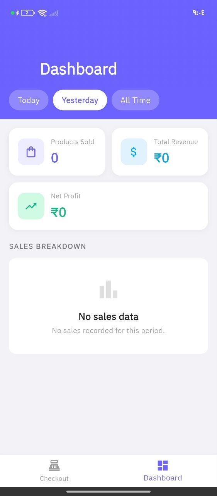
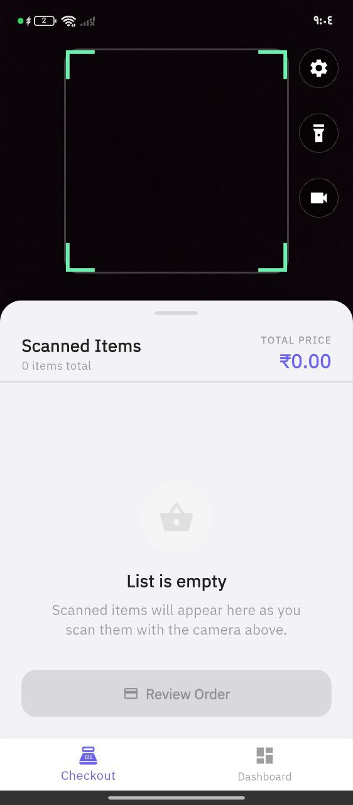
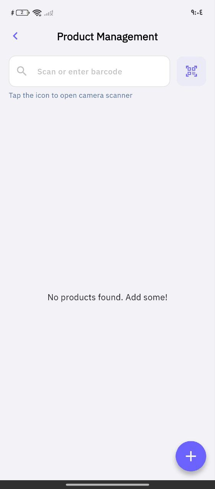
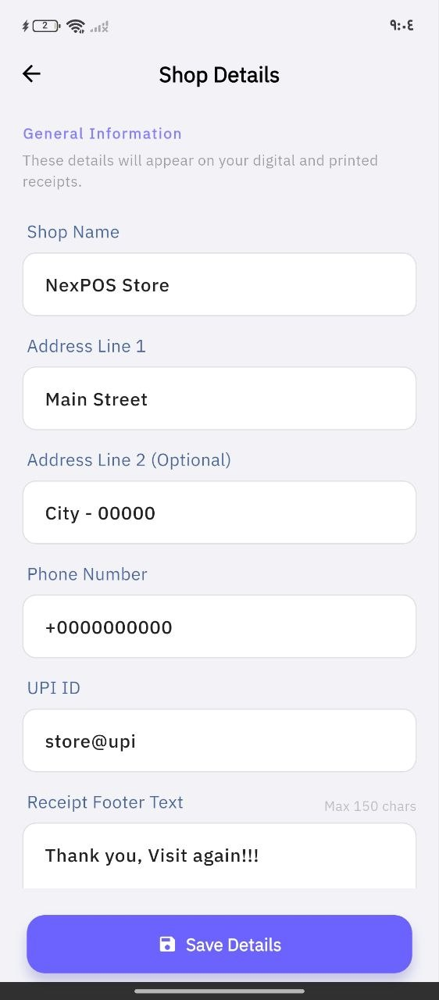
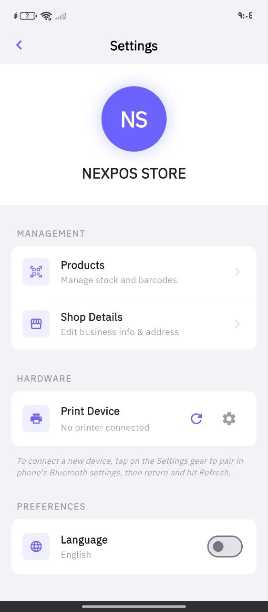

# 🛒 NexPOS Flutter

A feature-rich, high-performance offline-first billing and Point of Sale (POS) application built with Flutter. Designed for seamless retail checkout operations featuring barcode scanning, thermal Bluetooth printing, and robust local data persistence.

## 📸 Screenshots

| 📊 Dashboard (لوحة المعلومات) | 🏠 Main POS (الرئيسية) |
|:---:|:---:|
|  |  |

| 📦 Add Products (إضافة منتجات) | 🧾 Billing Info (معلومات الفاتورة) |
|:---:|:---:|
|  |  |

| ⚙️ Settings (الاعدادات) | |
|:---:|:---:|
|  | |

## 🎯 Project Scope

This application serves as a complete offline POS system for small to medium-sized retail shops. It streamlines the checkout process, catalog management, and receipt generation securely entirely on-device.

### Core Features:
- **Product Management System**: Complete CRUD operations for inventory items with barcode/QR code support.
- **Smart Checkout System**: Rapid cart building via camera-based barcode scanning or manual entry, and robust order calculation functionality.
- **Bluetooth Thermal Printing**: Direct integration with thermal printers (`print_bluetooth_thermal`) to instantly output physical receipts.
- **Shop Settings & Customization**: Centrally managed shop details printed dynamically on receipts.
- **Offline-First Architecture**: Powered by `Hive` for lightning-fast localized NoSQL data storage. No active internet connectivity required.
- **Dashboard & Analytics**: Real-time sales tracking with daily, weekly, and monthly revenue analytics.
- **Multi-Language Support**: Full localization support for English and Arabic with RTL layout.

## 🆕 Recent Updates

### Version 2.0.0 - Complete Rebrand & Enhancement

**New Identity:**
- Rebranded from `flutter_billing_app` to `NexPOS Flutter`
- New package name: `com.scxg1.nexposflutter`
- Updated repository: [https://github.com/scxg1/NexPOS-Flutter-](https://github.com/scxg1/NexPOS-Flutter-)

**New Features:**
- ✅ **Dashboard Module**: Real-time sales analytics with:
  - Total revenue tracking
  - Product performance metrics
  - Sales history visualization
  - Top-selling products analysis
- ✅ **Multi-Language Support**: 
  - English (default)
  - Arabic with full RTL support
- ✅ **Windows Desktop Support**: Native Windows application support

**Bug Fixes:**
- 🐛 Fixed Hive typeId conflict between ShopModel and SaleRecordModel adapters
- 🐛 Fixed black screen issue on app launch
- 🐛 Added comprehensive error handling for initialization failures

**Improvements:**
- ⚡ Improved app initialization with error handling
- ⚡ Better state management for language switching
- ⚡ Enhanced UI responsiveness

## 🛠 Tech Stack & Architecture

Built leveraging industry-standard architectural principles (Clean Architecture & Feature-Driven Design) ensuring scalability, separation of concerns, and robust testability. 

- **Framework**: [Flutter](https://flutter.dev/) (SDK >=3.1.0)
- **State Management**: `flutter_bloc`
- **Dependency Injection**: `get_it`
- **Routing**: `go_router`
- **Local Database**: `hive` & `hive_flutter`
- **Data Modeling**: `json_serializable`, `equatable`
- **Functional Programming**: `fpdart`
- **Hardware Integrations**: `mobile_scanner` (barcodes), `print_bluetooth_thermal`
- **Localization**: `flutter_localizations`, `intl`

## 📁 File Structure

The codebase is organized using a **Feature-First Clean Architecture** utilizing domain-driven concepts.

```text
lib/
├── config/                      # App configuration
│   └── routes/                  # GoRouter configuration
├── core/                        # Core application utilities and shared components
│   ├── data/                    # Global data sources (e.g., Hive initialization)
│   ├── error/                   # Standardized Failure/Exception models (fpdart compatible)
│   ├── theme/                   # UI aesthetics, typography, styling
│   ├── usecase/                 # Base UseCase contracts
│   ├── utils/                   # Helpers (e.g., PrinterHelper, formatters)
│   ├── widgets/                 # Reusable global UI widgets (AppBars, generic buttons)
│   └── service_locator.dart     # get_it dependency injection setup
├── l10n/                        # Localization files (ARB & generated)
└── features/                    # Independent feature modules
    ├── billing/                 # Core POS operations: Cart, Checkout, Invoice Generation
    ├── dashboard/               # Sales analytics and reporting
    ├── product/                 # Inventory management: Adding, Listing, Scanning products
    ├── settings/                # App configuration: Printer connections, Language settings
    └── shop/                    # Shop details configuration
```

*Note: Each feature is further subdivided internally into Clean Architecture layers: `data`, `domain`, and `presentation`.*

## 💡 Use Cases

- **Rapid Billing Entry**: A cashier launches the app, navigates to the checkout page, and uses the device camera to instantly scan product barcodes. The products are added to the cart, the total is calculated including taxes, and a receipt is finalized.
- **Physical Receipt Generation**: After checkout confirmation, the app triggers a connected external Bluetooth thermal POS printer to instantly print an itemized paper receipt with the shop's header.
- **Inventory Sideloading**: A manager opens the Product feature to add new stock to the local database, taking a picture of the barcode to bind the SKU for future lightning-fast checkouts.
- **No-Connection Operation**: The business operates a stall at an exhibition with poor networking. The app functions entirely via its embedded Hive local database and Bluetooth, completely undisturbed by network drops.
- **Sales Analytics**: A shop owner reviews the dashboard to analyze daily sales performance, identify top-selling products, and track revenue trends.

## 🚀 Getting Started

### Prerequisites
- Flutter SDK `^3.1.0` or higher
- Android Studio / Xcode for emulators and building.
- Visual Studio with "Desktop development with C++" workload (for Windows builds)
- *Optional*: A physical Android/iOS device and a Bluetooth Thermal Printer for testing hardware integrations natively.

### Installation

1. Clone the repository and navigate to the project directory:
   ```bash
   git clone https://github.com/scxg1/NexPOS-Flutter-.git
   cd NexPOS-Flutter-
   ```

2. Fetch dependencies:
   ```bash
   flutter pub get
   ```

3. Generate localization files:
   ```bash
   flutter gen-l10n
   ```

4. Run code generation (required for Hive adapters and JSON serialization):
   ```bash
   dart run build_runner build --delete-conflicting-outputs
   ```

5. Run the project:
   ```bash
   flutter run
   ```

### Platform-Specific Setup

#### Android
```bash
flutter run -d android
```

#### Windows
```bash
# Requires Visual Studio with C++ workload
flutter run -d windows
```

#### Web
```bash
flutter run -d chrome
```

## 📱 Supported Platforms

| Platform | Status |
|----------|--------|
| Android | ✅ Fully Supported |
| Windows | ✅ Supported (requires Visual Studio) |
| iOS | ✅ Supported (requires Xcode on macOS) |
| Web | ✅ Supported |
| Linux | ⚠️ Partial Support |
| macOS | ⚠️ Partial Support |

## 🤝 Contributing Guidelines

1. **Clean Architecture Rules**: Maintain strict boundaries between `domain`, `data`, and `presentation` layers.
2. **Immutable States**: Emit only immutable states from BLoCs utilizing `equatable`.
3. **No Direct Exceptions in Domain**: Utilize `fpdart`'s `Either<Failure, Type>` pattern to handle control flow for exceptions.
4. **Localization**: All user-facing strings must be localized using ARB files.

## 📄 License

This project is licensed under the MIT License - see the LICENSE file for details.

## 🔗 Repository

[https://github.com/scxg1/NexPOS-Flutter-](https://github.com/scxg1/NexPOS-Flutter-)

## 🙏 Credits

This project was originally forked from [flutter_billing_app](https://github.com/Dinesh-Sowndar/flutter_billing_app) and has been extensively modified and enhanced with new features including:
- Complete rebranding to NexPOS
- Dashboard and analytics module
- Multi-language support (English/Arabic)
- Windows desktop support
- Bug fixes and performance improvements
